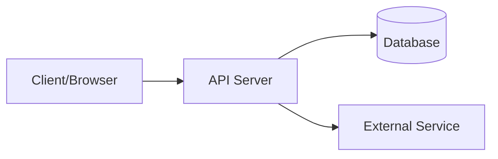

# Arsitektur Sistem

**Terakhir diupdate:** [YYYY-MM-DD]
**Stack aktif:** lihat `STACK.md` di folder yang sama

## Overview

[Deskripsi singkat: aplikasi ini apa, untuk siapa, masalah apa yang diselesaikan. 3-5 kalimat. Detail ringkas ada di `STATE.md`.]

## Tech Stack

| Layer | Teknologi | Catatan |
|---|---|---|
| Frontend | | |
| Backend | | |
| Database | | |
| Auth | | |
| Hosting/Infra | | |
| Queue/Cache | | |

> Aturan spesifik per stack ada di `STACK.md` (hasil merge dari `stacks/*.md` template). Jangan duplikasi di sini.

## Struktur Folder

```
project/
├── lib/ atau src/              # lihat STACK.md untuk detail
│   ├── features/ atau modules/
├── docs/
│   ├── 00_overview/            # kamu di sini
│   │   ├── ARCHITECTURE.md     # index ini
│   │   ├── STATE.md
│   │   └── STACK.md
│   ├── 01_guides/
│   ├── 02_reference/
│   ├── 03_logs/
│   └── modules/                # detail per modul
└── ...
```

## Alur Data / Flow Utama



[Flow request paling umum. Untuk flow per modul, taruh di `modules/[modul].md`.]

## Daftar Modul

> **Aturan modular (`AGENTS.md:9`):** File ini hanya index. Detail tiap modul ada di `docs/modules/`. AI wajib baca file modul yang relevan sebelum kerjakan task di modul tersebut.

| Modul | Deskripsi singkat | Dokumen | Status |
|---|---|---|---|
| [Auth] | Login, register, role | [modules/auth.md](../../docs/modules/auth.md) | Done / WIP |
| [Dashboard] | Analitik, manajemen user | [modules/dashboard/](../../docs/modules/dashboard/) | WIP |
| [Pembayaran] | Checkout, invoice | [modules/pembayaran.md](../../docs/modules/pembayaran.md) | Planned |

*Jika modul sederhana (<200 baris, 1-3 fitur): 1 file `modules/nama.md`.*
*Jika kompleks (>3 fitur): folder `modules/nama/README.md` + file per fitur.*

## Integrasi Eksternal

| Service | Fungsi | Auth | Docs |
|---|---|---|---|
| | | | |

## Environment Variables Penting

| Variable | Fungsi | Wajib? |
|---|---|---|
| | | |

> Cara setup env ada di `01_guides/GETTING_STARTED.md`.

## Catatan Penting untuk AI / Dev Baru

- [Hal non-obvious, misal: “field `status` pakai integer bukan enum karena X”]
- [Workaround yang sengaja dipertahankan]
- [Link ke `01_guides/GLOSSARY.md` jika ada istilah yang perlu disepakati]
