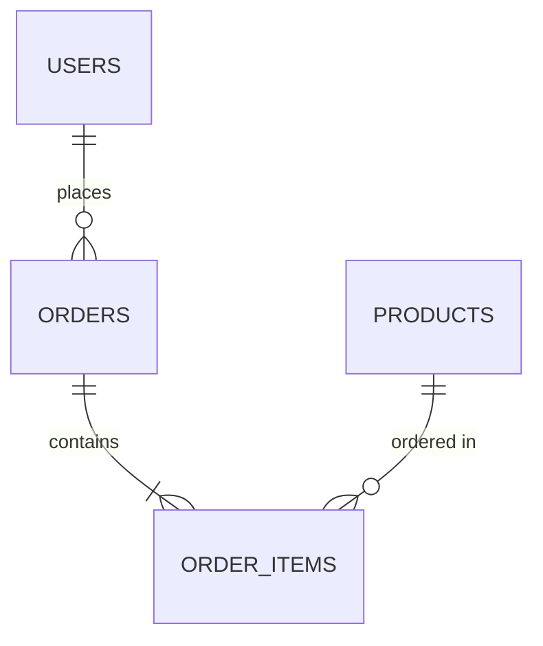

# Skema Database

> Update file ini setiap ada perubahan tabel/kolom/relasi/migration. Ini bagian paling sering basi kalau tidak didisiplinkan — jadi AI agent WAJIB update di sesi yang sama saat mengubah schema, bukan "nanti".

**Terakhir diupdate:** [YYYY-MM-DD]
**Database:** [PostgreSQL / MySQL / MongoDB / dll]

## ERD (Entity Relationship Diagram)

## Tabel: `users`

| Kolom | Tipe | Constraint | Deskripsi |
|---|---|---|---|
| id | uuid | PK | |
| email | varchar(255) | unique, not null | |
| created_at | timestamp | not null, default now() | |

## Tabel: `[nama_tabel_berikutnya]`

| Kolom | Tipe | Constraint | Deskripsi |
|---|---|---|---|
| | | | |

## Relasi Antar Tabel

- `orders.user_id` → `users.id` (many-to-one)
- [tambahkan relasi lain]

## Index Penting

| Tabel | Kolom | Tipe index | Alasan |
|---|---|---|---|
| | | | |

## Migration History

| Tanggal | File migration | Deskripsi singkat |
|---|---|---|
| [YYYY-MM-DD] | `0001_init.sql` | Setup awal: tabel users, orders |

## Catatan Khusus

- [Kolom yang punya arti tidak obvious, misal: "status: 0=draft, 1=published, 2=archived"]
- [Soft delete convention kalau dipakai]
