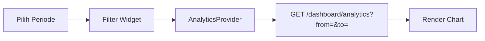

# Fitur: Dashboard > Analytics

**Induk modul:** [Dashboard](./README.md)
**Terakhir diupdate:** [YYYY-MM-DD]
**Lokasi kode:** `lib/features/dashboard/analytics/`
**API terkait:** `GET /dashboard/analytics`

## Fungsi

Menampilkan grafik transaksi / aktivitas dengan filter periode. Contoh fitur yang dipecah jadi file sendiri karena kompleks.

## Flow

## Sub-fitur

### Filter Periode

- Input: `from`, `to` (format `YYYY-MM-DD`, lihat `CONVENTIONS.md`)
- Validasi: `from` tidak boleh > `to`, max range 90 hari

### Export CSV

- Tombol export → `GET /dashboard/analytics/export` → download file

## Tabel / Data Terkait

- `transactions` → agregasi per hari
- Cache: `analytics_cache` (TTL 5 menit)

## Catatan untuk AI Agent

- Grafik pakai library yang sudah di `STACK.md` (Flutter: `fl_chart`, jangan ganti tanpa ADR).
- Jika ubah query agregasi, update juga `DATABASE_SCHEMA.md` bagian index.
